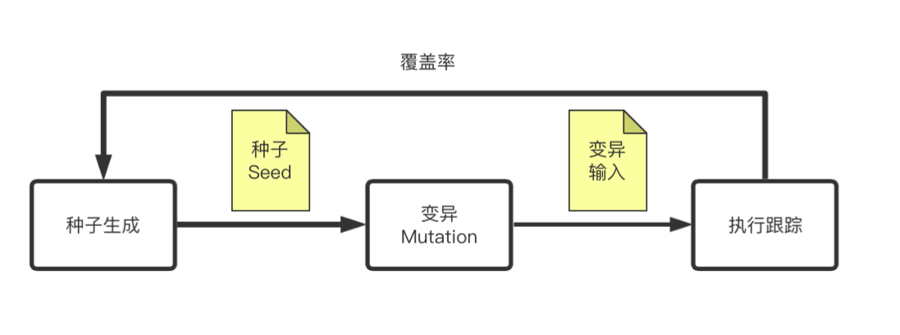
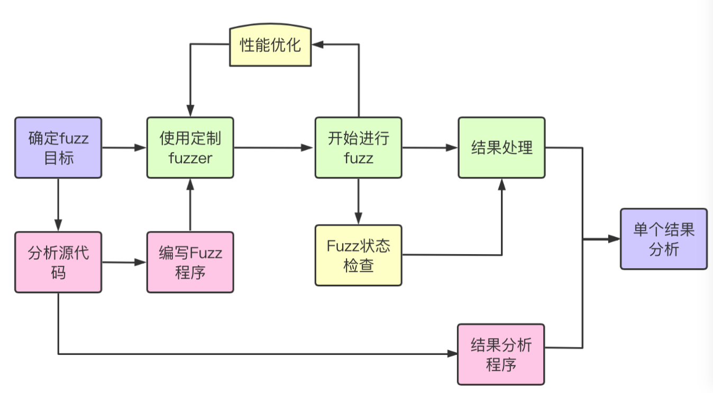
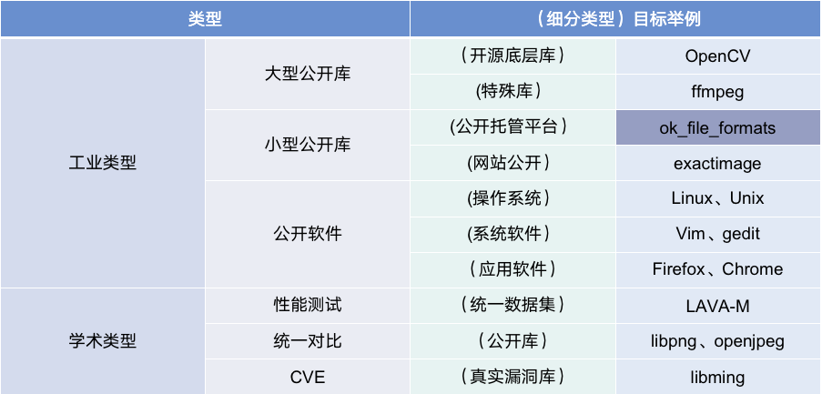
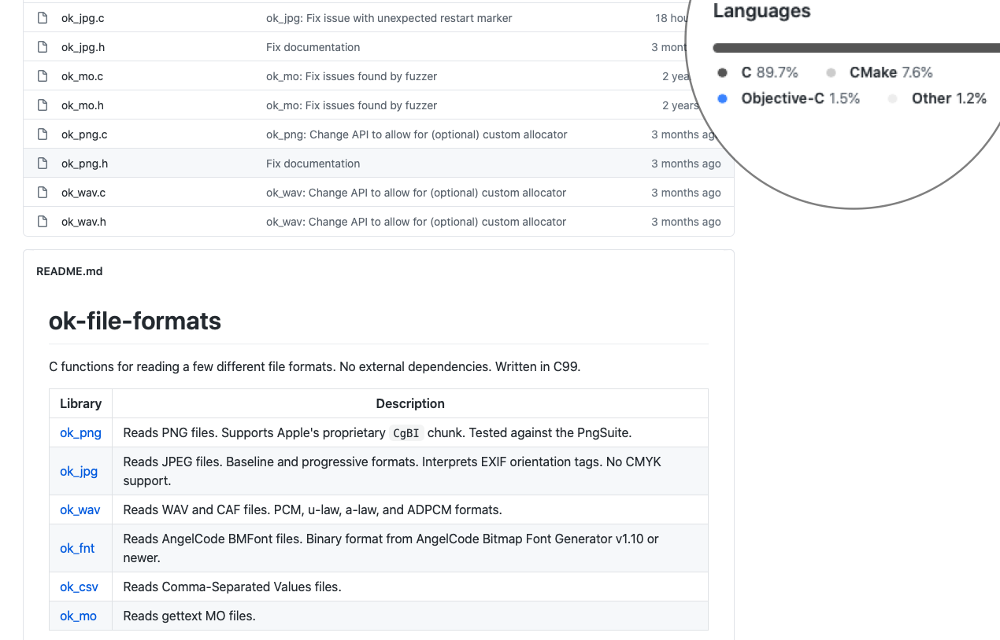
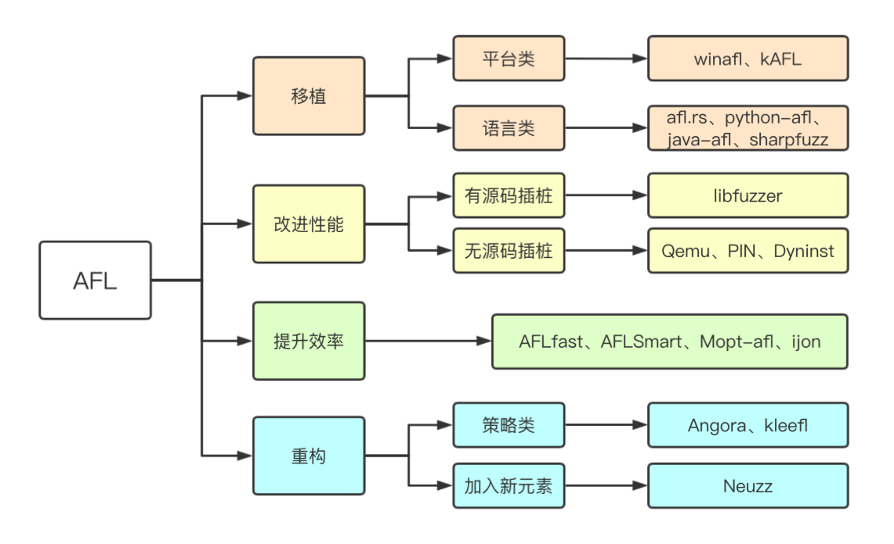
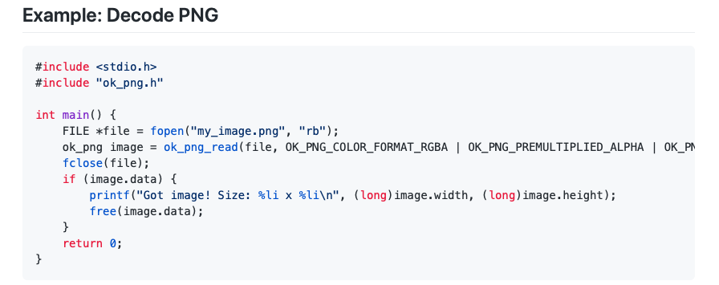
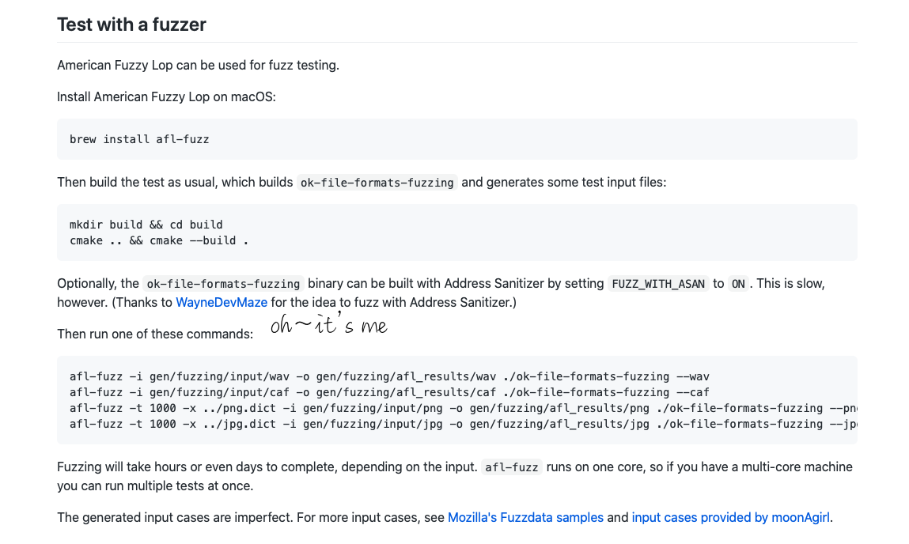

# 完整Fuzz过程 —— ok-file-formats

## 前言
本篇是之前写的《AFL笔记》（[上]()、[下]()）的后续，去年开始断断续续学习模糊测试写了两篇侧重分析Fuzz代码的笔记，这篇主要写一下这半年（很水的半年）的Fuzz过程总结的一些经验，用Git上的一个例子做解释：[ok_file_formats](https://github.com/brackeen/ok-file-formats)。有说的不对的地方，欢迎斧正，因为都是个人总结的一家之言，大家尽管吐槽就好。  

P.S.吐槽一下看雪的编辑器，没有找到草稿箱功能，之前写了一半，今天终于结束了实验课想补完，打开发现 GG，什么都没有了，只能重新整理思路从头再写一遍了。  

## 一、模糊测试
什么是模糊测试技术呢，就是用大量的随机输入去测试软件的健壮性等，最早是软件测试的概念。后来出现了afl，便出现了以覆盖率为导向的模糊测试技术。  

  

看图可以很好的理解，最开始给afl初始种子，然后经过变异得到输入，将输入给到待测试程序，并通过插桩技术对程序跟踪，或者覆盖率，个人认为现在这个覆盖率已经变成了一个大的概念，可以是块覆盖、可以是边覆盖、可以是很多其他有利于程序输入的信息，只要是有利于变异和种子筛选的都可以算，然后覆盖率指导之前的流程，周而复始，直到遇到崩溃情况，便将其保存。  
这种覆盖率的想法使得输入不再是随机盲目的，可以说afl的出现使得模糊测试进入了新的阶段，虽然afl在2.52b版本之后就停止更新了，但是Google目前还一直维护着，而且后来出现了很多分支。今天用到的模糊测试工具就是AFL，其实其他工具使用思路也大同小异，都可以借鉴。  

## 二、Fuzz过程图
要想走完一个完整的Fuzz过程，不是仅仅知道上面说的原理就可以的做到的，还是要从整体的流程上进行说明才行。

  

整个流程是从确定fuzz目标开始，到单个crash分析结束，主要包含三部分：  
1. 浅绿色：主线流程，一般情况下确定好fuzz目标之后，就挑选合适到fuzzer，然后进行fuzz，这个fuzz的过程可长可短，视情况而定。最后可能一个crash都没有，也可能有好多crash，甚至会出现上百个，虽然fuzzer会说是unique crash，实际上很多情况下会出现很多触发相同漏洞的crash，这时候就需要进行一定的处理，得到真正的unique crash，然后再对单个结果进行分析。  
2. 粉红色：辅助流程，当确定了fuzz目标之后需要分析源代码，然后编写两段程序，分别是给fuzzer用的程序和验证漏洞用的内存检测程序。
3. 黄色：小工具类的使用，比如afl-whatsup、afl-plot、afl-cmin、afl-tmin、afl多线程等等。

## 三、选择目标程序
### 3.1 类型  
通常情况下要进行fuzz之前，应该先了解你的目标是什么样子的，代码量大还是小，开源还是闭源，属于文件读取类型还是协议类型，等等等等。下面列了一个表格是我所接触范围内的一个分类，当然随着研究的继续，这个表格会继续扩充。 

   

>1). 工业类型  
&emsp;1.1). 大型公开库：主要是指那些调试安装都很麻烦的库，这类库的 fuzz 难点有三：  
&emsp;第一、漏洞少，这些库虽然都是开源的，但是因为用到的人很多，基本上都维护好多年了，很完善了已经，剩下的漏洞不多了，简单的洞肯定都被人挖出来了，所以跑出漏洞的概率有点点看运气；  
&emsp;第二、调试麻烦，随着项目的维护，很多公开库已经不再是当初单纯的单一功能，而且安装、使用都需要一定的学习时间成本，如果本身对这一类又不是很熟悉的情况下，浪费的时间会很多；  
&emsp;第三、体量大，因为项目涉及函数超级多，所以即使得到了crash，在分析crash是否可用的时候也会非常麻烦，有可能这个crash是因为引用的别的库的旧版本导致的。  
因此不管是从哪方面讲，大型公开库的Fuzz都是很有难度的，但是这也意味着一旦发现漏洞，那将是很宝贵的。下面举两个不同类型的例子的坑：  
&emsp;&emsp;1.1.1). 开源底层库 - OpenCV，刚过年的时候我尝试过用libfuzzer对其进行模糊测试，可以说这个库完全满足上面三点（😂），刚开始在编译阶段就把我卡了好久，再加上那时候也不太懂，就瞎搞，换了好几个docker容器，最后好不容易搭好了环境，开开心心的跑读取函数，最后有几个crash，一跟踪发现是个其他库的，而且还不是漏洞，就很气。。。  
&emsp;&emsp;1.1.2). 使用量大 - ffmpeg，有一类库虽然体积不大，但是用户基数超级大，ffmpeg就是属于这一类，毕竟微信传视频用的都是这个库，但是这一类的库就是上面说的第一条，漏洞极少，被这么多用户进行了检验，要想跑出洞，真的是超级难。  
&emsp;1.2). 小型公开库：与大型相对，就是指那类关注量小，使用量少的库。这一类库一般fuzz难度小，好编译，而且写测试程序也好写。我一般找这些库的方式有两种：  
&emsp;&emsp;1.2.1). 公开托管平台比如github、dockerhub上面的公开库或者软件，比如ok_file_mormats就是我等下要举的例子，就是来自GitHub。比如我要fuzz图像类型的库，就搜索png、jpg、img等等这类关键词，然后按照star多少的顺序排序，然后假设是想要C语言的库就在左侧选中只要C； 
&emsp;&emsp;1.2.1). 再有就是网站公开的一些库，这一类有自己的补丁版本，有小公司或者小团队维护，而且漏洞上报也不方便，我一般不选这一类，有这精力还不如搞大的；   
&emsp;1.3). 公开软件：这类我目前接触的不多，之后应该可能看看研究研究，我主要分了三类软件：一是针对操作系统，比如Linux、unix；二是针对常用系统软件，比如vim、gedit；三是通用应用软件，比如浏览器火狐、Chrome（还推荐一个方式，可以查Chrome用了哪些库，去测试那些库准没错）。  
2). 学术类型  
&emsp;2.1). 性能测试，一般采用统一数据集，像lava-m（基本上近几年的Fuzzing论文都跑这个库做性能测试），为了证明在普遍认同的同一情况下自己的fuzzer比别人好；  
&emsp;2.2). 统一对比，一般是用公开库，这时候一般用真实的库来对比，一般就放自己效果好的库，不考虑版本问题，不一定会用最新版本的库；  
&emsp;2.3). 为了CVE，一般是为了跑出真实的漏洞，挑选的多是上面工业类型里的小型库，有的时候一些顶会文章会涉及到大型库，不过感觉今年fuzzing的申请CVE开始变得好难了，不好搞呀；  
>
最后挑选的是一个文件转换库，其实严格意义上也不是个库了，算是个提供很多文件转换标准的函数汇总吧。第一是因为这个比较简单，内容少，好分析；第二是因为作者自己就做了一个test的文件夹，放了很多testcase，就免去了我们自己搜集了。  



### 3.2 种子准备
当经过挑选之后找到了合适的目标程序，那么紧接着下一步一定是找初始种子了，这个种子的好坏其实说重要还是蛮重要的，如果fuzz的目标比较小，像这个ok-file-formats，可能用afl自带的图片testcase就够了，不过这个作者提供了一些之前能触发漏洞的testcase，可以说是非常有帮助了。  
当然并不是所以的软件作者都这么有良心，最好的办法就是积累，在fuzz的时候有同类型文件触发漏洞的可以考虑留下，给其他同类型库用，遇到合适的留下，久而久之就有不小的testcase库啦。  

## 四、挑选合适的Fuzzer
这一步我单独写一个章节是因为这里很重要，虽然说我们一直讨论的是用AFL相关，但是实际上在此基础上有很多很多的分支，我才疏学浅，这里就列一小部分（有兴趣可以找这三四年顶会的综述论文看一下，一定会有收获的）  

  

关于AFL的分支，我这里分为四类（并不一定是afl转来了，但一定是受其思想影响的进步）：  
#### 移植
1. afl多是用在Linux的c语言类程序文件模糊测试，所以就有人做了平台移植：最经典的就是winafl，在Windows平台下的模糊测试工具；  
2. 还有针对语言的移植，比如针对rust语言的/afl.rs、针对python语言的python-afl、针对Java语言的java-afl、针对C#语言的sharpfuzz；  
#### 性能的改进
1. 这部分是指速度性能的改进，既有针对有源码的libfuzzer，通过用llvm、clang框架大大提升了性能，这部分Google自家的fuzzer做的算是很好了，还有honggfuzz，都是对afl的很大改进；
2. 也有针对无源码的，像Qemu、PIN、Dyninst这些工具的引入，尽管说afl自带的系统里有qemu等但是效率不理想，所以就有一些别的大牛单独做的新的分支，甚至还有跟Frida结合的应用；  
#### 提升效率
这部分每年都会看见论文的新花样，针对变异策略的、针对种子筛选的层出不穷，afl-smart、ijon等等，不管是加入符号执行还是对策略改进，实际上对afl给改动并不大。主要还是从理论上进行了设想，提出了新思路；  
#### 重构
1. 基本上跟原来对afl差别很大了，一种是对整个变异策略全部重建，比如Angora就是用rust语言重新写对，并且用了自己新对变异策略；  
2. 另一种是加入新元素，比如Neuzz这个就是加入了机器学习，再比如今年出现了一些对蓝牙的、对use设备对模糊测试；  

总结下来就是一二类属于实际应用类，比较注重运用，怎么用的舒服，用得快怎么来，三四类属于理论类，比较注意想法。这篇文章的fuzz目标是文件类型的，而且是个小库，就用afl就够了，算是抛砖引玉了。  

## 五、开始进行Fuzzing
前面都算是准备工作，接下来是真正的写代码的部分，先把代码clone下来：  
`git clone https://github.com/brackeen/ok-file-formats.git`  
查看readme和GitHub上浏览一下结构，分析一下，可以发现两个比较有意思的点：  
1. 项目总的readme不仅给出了项目介绍，还给出了一个简单的例子，这个例子就是我们的突破口，极大减少了学习时间，接下来的程序编写就可以借鉴这里的例子。  
  
2. 另外一个惊喜就是，在test文件夹下的readme，给出了关于如何fuzz的介绍，以及这些testcase怎么用，哪里来的等等。  
  
就在我写这篇文章的时候发现，作者把我之前提交issue描述中有用的部分给加到描述里面了，有点小开心。
### 5.1 编写Fuzz程序  
&emsp;接下来言归正传，现在知道了一个简单的例子，首先就来编写Fuzz用的程序，编写的这个程序的目的就是为了把要测试的函数加进去。我们照着葫芦画瓢，写一个读jpg文件的程序：  
```C
#include <stdio.h>
#include <stdlib.h>
#include "ok_jpg.h"
#include "ok_jpg.c"

int main(int _argc, char **_argv) {
    //把第一个参数当作文件名，这个名就是个相对路径，不过在fuzz的时候可以用@@来代替
    FILE *file = fopen(_argv[1], "rb");
    //读取jpg格式图片
    ok_jpg image = ok_jpg_read(file, OK_JPG_COLOR_FORMAT_RGBA);
    fclose(file);
    if (image.data) {
        printf("Got image! Size: %li x %li\n", (long)image.width, (long)image.height);
        free(image.data);
    }
    return 0;
}
```
把作者给的例子简单改一下，
### 5.2 用 AFL 进行Fuzz  

### 5.3 查看Fuzz状态  

afl-whatsup  
afl-plot

### 5.4 性能优化

种子筛选  
多线程  

## 六、结果分析

### 6.1 验证程序

### 6.2 crash处理

### 6.3 漏洞提交issue